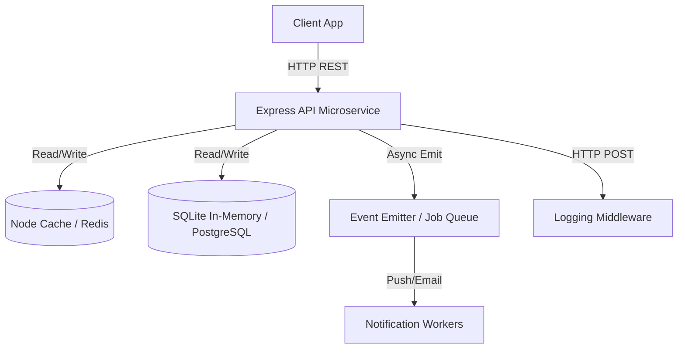

# Backend Engineering Track

A comprehensive backend system engineered for scale, reliability, and algorithmic efficiency. This repository encompasses custom NPM packages, system architecture design, an Express.js microservice, and dynamic programming algorithms.

---

## Table of Contents
- [Overview](#-overview)
- [Project Architecture](#%EF%B8%8F-project-architecture)
- [Implementation Phases](#-implementation-phases)
  - [Phase 1: Logging Middleware](#phase-1-logging-middleware)
  - [Phase 2: System Design](#phase-2-system-design)
  - [Phase 3: Backend Microservice](#phase-3-backend-microservice)
  - [Phase 4: Optimization Algorithm](#phase-4-optimization-algorithm)
- [Installation & Setup](#%EF%B8%8F-installation--setup)
- [API Reference](#-api-reference)

---

## Overview
This project was developed as a multi-phase backend evaluation focusing on clean code, modular architecture, and optimization. It spans across multiple domains including RESTful API development, asynchronous message queueing, caching strategies, and solving NP-hard resource allocation problems using Dynamic Programming.

---

## Project Architecture



---

## Implementation Phases

### Phase 1: Logging Middleware
**Location:** `/logging_middleware`

A reusable, standalone Node.js logging package designed to be imported across microservices.
- Intercepts debug, info, warn, and error logs.
- Automatically routes log payloads via `fetch` to an external centralized logging API.
- Fully decoupled and utilized throughout the application.

### Phase 2: System Design
**Location:** `/notification_system_design.md`

A thorough technical specification defining the architecture of a high-throughput Notification System.
- **REST APIs:** Structured payloads and routing contracts.
- **Database:** PostgreSQL relational models with B-Tree indexes for fast student-specific lookups.
- **Optimization:** Caching strategies (Redis) and query optimization for large datasets.
- **Reliability:** Message broker/queue architecture for resilient email and push notification dispatch.
- **Priority Algorithm:** Includes a functioning Priority Inbox calculator script (`notification_app_be/priority_inbox/index.js`) that scores notifications based on urgency (Placement > Result > Event) and recency.

### Phase 3: Backend Microservice
**Location:** `/notification_app_be`

A robust Node.js and Express microservice that implements the Phase 2 designs.
- Built with an **in-memory SQLite** database for frictionless local execution and testing.
- Features **Fast caching** using `node-cache` to eliminate redundant database queries on unread messages.
- Uses **Event Emitters** to mock background worker queues, ensuring API responses remain sub-millisecond even when dispatching thousands of notifications.
- Verified and benchmarked via an automated testing script (`test_api.js`) which generates `screenshots_phase3.txt`.

### Phase 4: Optimization Algorithm
**Location:** `/vehicle_maintence_scheduler`

An algorithmic solution to a resource allocation problem.
- Consumes external REST APIs to fetch real-time constraints (Budgets, Task Durations, and Impact Scores).
- Uses the **0/1 Knapsack Dynamic Programming** algorithm to compute the optimal subset of tasks that yield the highest impact without exceeding mechanic hour budgets.
- Automated execution results are saved in `screenshot_phase4.txt`.

---

## Installation & Setup

Ensure you have [Node.js](https://nodejs.org/) installed on your machine.

### 1. Notification Backend (Phase 3)
Navigate to the backend directory, install dependencies, and start the server:
```bash
cd notification_app_be
npm install
node server.js
```
The server will start on `http://127.0.0.1:31337`.

**Run Automated Tests:**
In a separate terminal, run:
```bash
node test_api.js
```

### 2. Priority Inbox Calculator (Phase 2 - Stage 6)
```bash
cd notification_app_be/priority_inbox
node index.js
```

### 3. Vehicle Maintenance Scheduler (Phase 4)
```bash
cd vehicle_maintence_scheduler
npm install
node index.js
```

---

## API Reference

The Phase 3 microservice exposes the following core endpoints:

| HTTP Method | Endpoint | Description |
| :--- | :--- | :--- |
| `GET` | `/api/notifications` | Fetch all notifications for the user |
| `GET` | `/api/notifications/unread` | Fetch only unread notifications (Cached) |
| `GET` | `/api/notifications/type/:type` | Fetch notifications grouped by type |
| `POST` | `/api/notifications` | Create a new notification & queue background job |
| `PUT` | `/api/notifications/:id/read` | Mark a specific notification as read |
| `PUT` | `/api/notifications/read-all` | Mark all unread notifications as read |
| `DELETE` | `/api/notifications/:id` | Delete a specific notification |

*(All routes require a valid `Bearer` token in the `Authorization` header)*
